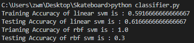
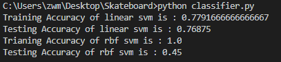

# Skateboard
Computer Vision 2020 Course Project


Get the complete code from GitHub: https://github.com/LDRfans/Skateboard


## HOW TO RUN

```sh
cd boundingBox
cd code
python3 net.py
```


## Dev log

### Ziqi's part

### 12/12

- Running openpose successfully;

- Uploading the result on reduced dataset in `pose` , with json and jpg format for each image.


### 12/16

- Parse json files from openpose;

- Calculate 4 Angles and show the result.

### 12/18

- Process pose data into a csv file, with label mapping being { 0:flying, 1:sliding, 2:static}

- Testing multi-class classification using SVM on COCO dataset 

  |                                           | linear svc | rbf svc |
  | ----------------------------------------- | ---------- | ------- |
  | 3 classes, 100 imgs for each class        | ~0.60      | ~0.3    |
  | 2 classes (flying T/F), 200 imgs for each | ~0.75      | ~0.5    |

- Question: rbf overfit????

- 3 classes:



- 2 classes: 



### 12/19

- Add 4 more angles;
- Imputed data with average in each class;
- Run OpenPose with regularized pixel coordinate: scale it in the range [0,1], where (0,0) would                                               be the top-left corner of the image, and (1,1) the bottom-right one;

- Form coco_pose.csv and coco_angle.csv.

- Now input: 25(kp)*3(x,y,confidence) + 8(angles) + bb 