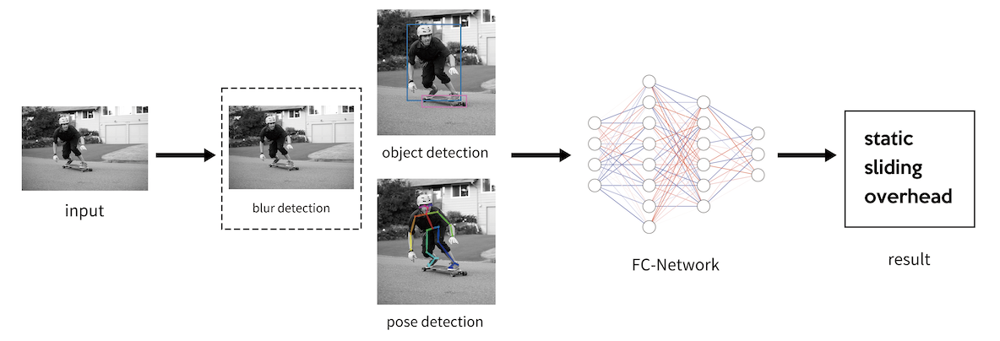
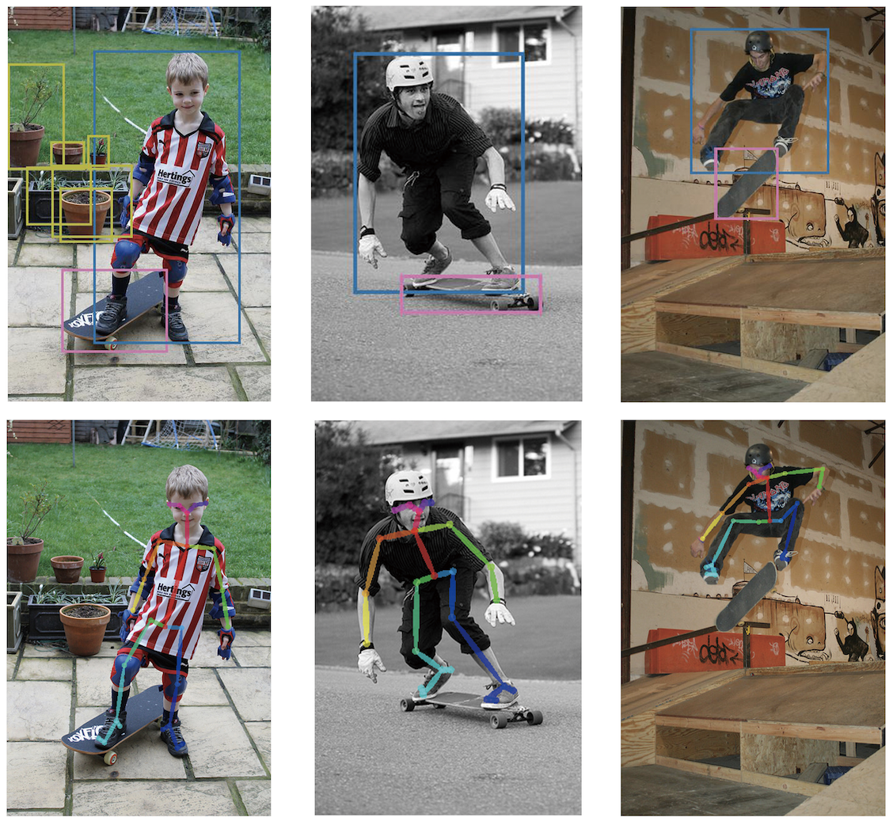

# Skateboard
Computer Vision 2020 Course Project






## HOW TO RUN

```sh
cd boundingBox
cd code
python3 net.py
```

## Reference

openpose[CMU]:https://github.com/CMU-Perceptual-Computing-Lab/openpose


